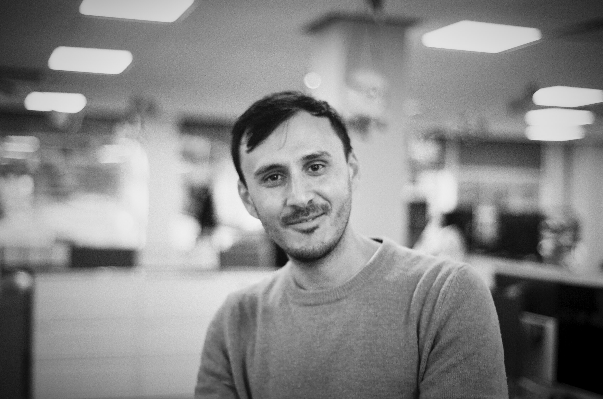

  

My name is Saman, an Engineering Lead based in London with a passion for mobile app development with 12 years of experience in the industry. My journey has involved playing critical roles in renowned organizations like J.P. Morgan Chase and Sky, delivering excellence in mobile and full-stack applications that strike the perfect balance between efficiency, scalability, and testability.

Currently serving as a Senior Staff Engineer at J.P. Morgan Chase, I've had the opportunity to integrate financial products into dynamic platforms, ensuring the seamless transfer of complex concepts to team members. My expertise in languages such as Swift/Objective-C, Kotlin/Java, GoLang, JS/TS, and many more, along with my proficiency in technologies like iOS, UIKit, SwiftUI, XCTest, RXSwift, and Combine, among others, enables me to drive development with efficacy and finesse.

My stint as a Principal Mobile Engineer and Lead iOS Developer at Sky was instrumental in honing my leadership skills, leading cross-departmental initiatives, and fostering a learning environment for developers. Here, I also spearheaded the Mobile Developer Academy company initiative to design and manage an engineering training project for graduates, which I consider a personal achievement.

Before joining Sky, I cut my teeth as a Principal iOS Engineer at Mixlr, where I developed and maintained a live audio streaming iOS app and built a multithreaded audio broadcasting engine. This invaluable experience set the groundwork for my subsequent roles, where I applied the lessons learned and delivered high-quality apps on a far more regular cadence.

Apart from technical knowledge, I bring to the table excellent communication, leadership, and teamwork skills, complemented by a proactive and self-assured approach towards problem-solving.

My educational background in Music Informatics from the University of Sussex underpins my unique approach to software development, enabling me to harmonize technology with user needs and forge innovative solutions. I've never shied away from challenges, and I'm always looking forward to the next big thing. I believe that the future holds exciting prospects, and I'm more than ready to explore them.